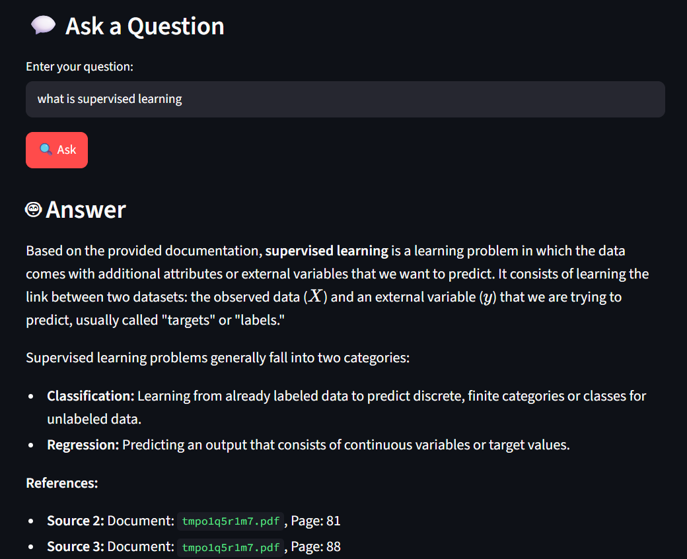

# 📚 Technical Documentation Assistant

A **Retrieval-Augmented Generation (RAG)** based web application that allows users to upload a PDF document and ask questions about its content.

The application extracts text from the uploaded PDF, divides it into smaller chunks, converts the chunks into semantic embeddings, searches for relevant information using FAISS, and uses Google Gemini to generate a grounded answer.

## 🎯 Objective

The objective of this project is to develop an intelligent document question-answering system that allows users to interact with their own PDF documents using natural language.

The system retrieves relevant information from the uploaded document before generating an answer, helping keep responses grounded in the provided document.

## 🚀 Features

* 📤 Upload PDF documents directly through the web application
* 📄 Extract text from PDF files
* ✂️ Split document text into overlapping chunks
* 🧠 Generate semantic embeddings using Sentence Transformers
* 🔎 Perform semantic similarity search using FAISS
* 🤖 Generate answers using Google Gemini
* 📚 Display retrieved document sources
* 📑 Show page numbers for retrieved content
* 📊 Display similarity scores
* 🌐 Simple Streamlit web interface
* 🔐 Secure API-key management using environment variables

## 🏗️ System Architecture

```text
                User
                  │
                  ▼
             Upload PDF
                  │
                  ▼
          PDF Text Extraction
                  │
                  ▼
            Text Chunking
                  │
                  ▼
       Sentence Transformer
            Embeddings
                  │
                  ▼
          FAISS Vector Store
                  │
                  │
           User Question
                  │
                  ▼
       Question Embedding
                  │
                  ▼
        Semantic Similarity
             Search
                  │
                  ▼
       Relevant Document
             Chunks
                  │
                  ▼
          Google Gemini
                  │
                  ▼
        Grounded Answer
                  │
                  ▼
       Sources + Page Numbers
```

## 🛠️ Technologies Used

| Technology            | Purpose                         |
| --------------------- | ------------------------------- |
| Python                | Application development         |
| Streamlit             | Web application interface       |
| PyMuPDF               | PDF text extraction             |
| Sentence Transformers | Semantic embeddings             |
| FAISS                 | Vector similarity search        |
| Google Gemini         | Answer generation               |
| python-dotenv         | Environment variable management |
| NumPy                 | Numerical operations            |

## 📁 Project Structure

```text
Technical_Documentation_Assistant/
│
├── data/
│   └── documents/
│
├── src/
│   ├── pdf_loader.py
│   ├── chunker.py
│   ├── embeddings.py
│   ├── vector_store.py
│   ├── generator.py
│   └── rag_pipeline.py
│
├── app.py
├── README.md
├── requirements.txt
└── .gitignore
```

## 🔄 How the System Works

### 1. Upload PDF

The user uploads a PDF through the Streamlit interface.

The application temporarily saves the uploaded file and sends it to the RAG pipeline.

### 2. PDF Text Extraction

PyMuPDF extracts readable text from each page.

Each page is stored with:

* Document name
* Page number
* Extracted text

### 3. Text Chunking

The extracted text is divided into smaller overlapping chunks.

The current implementation uses:

* Chunk size: **500 words**
* Overlap: **100 words**

Chunking allows the system to search smaller sections of a document efficiently.

### 4. Embedding Generation

Each text chunk is converted into a numerical vector using:

```text
all-MiniLM-L6-v2
```

The model generates **384-dimensional embeddings**.

### 5. FAISS Semantic Search

The embeddings are stored in a FAISS vector index.

When the user asks a question:

1. The question is converted into an embedding.
2. FAISS compares it with the document embeddings.
3. The most semantically relevant chunks are retrieved.

### 6. Gemini Answer Generation

The retrieved chunks are provided to Google Gemini as context.

The model is instructed to answer using the provided documentation and avoid guessing or inventing information.

### 7. Source Display

The application displays the retrieved sources with:

* Document name
* Page number
* Similarity score
* Retrieved text

This allows the user to verify the information used to generate the answer.

## 💻 Installation

Clone the repository:

```bash
git clone YOUR_GITHUB_REPOSITORY_URL
cd Technical_Documentation_Assistant
```

Create a virtual environment:

```bash
python -m venv venv
```

Activate the environment on Windows PowerShell:

```powershell
.\venv\Scripts\Activate.ps1
```

Install the dependencies:

```bash
pip install -r requirements.txt
```

## 🔑 Gemini API Key Setup

Create a file named:

```text
.env
```

in the project root.

Add:

```text
GEMINI_API_KEY=YOUR_GEMINI_API_KEY
```

The application reads the API key using `python-dotenv`.

**Never upload `.env` to GitHub.**

## ▶️ Run the Application

Start Streamlit:

```bash
streamlit run app.py
```

The application will open in your web browser.

## 🖥️ Usage

### Step 1

Open the application.

### Step 2

Click:

```text
📤 Upload your PDF
```

and select a PDF document.

### Step 3

Wait for the document to be processed.

The application creates:

* Text chunks
* Embeddings
* FAISS vector index

### Step 4

Enter a question related to the uploaded document.

Example:

```text
What is Artificial Intelligence?
```

### Step 5

Click:

```text
🔍 Ask
```

### Step 6

The application displays the generated answer and retrieved document sources.

## 📊 Example Workflow

```text
PDF
 ↓
576 Pages
 ↓
Text Extraction
 ↓
660 Text Chunks
 ↓
384-Dimensional Embeddings
 ↓
FAISS Search
 ↓
Top Relevant Chunks
 ↓
Gemini
 ↓
Answer + References
```

The exact number of pages and chunks depends on the PDF uploaded by the user.

## 🖥️ Application Screenshot



## 🔒 Security

The Gemini API key is stored in a `.env` file instead of being written directly in the source code.

The `.env` file is excluded from Git using `.gitignore`.

Do not publish or share your API key.

## ⚠️ Limitations

* The current application primarily processes text-based PDFs.
* Scanned PDFs containing only images may require OCR.
* Processing large PDFs can take additional time.
* The application currently processes one uploaded document at a time.
* The quality of answers depends on the quality and content of the uploaded document.
* The application requires a valid Gemini API key for answer generation.

## 🔮 Future Enhancements

* 📚 Support multiple PDF documents
* 🔍 Add a reranking stage
* 💬 Add multi-turn conversation history
* 🗂️ Add metadata filtering
* 📊 Add retrieval evaluation metrics
* 🧾 Support scanned PDFs using OCR
* ☁️ Deploy the application online
* 💾 Add persistent vector storage
* 📤 Support additional document formats

## 🎓 Learning Outcomes

This project demonstrates practical implementation of:

* Retrieval-Augmented Generation
* Natural Language Processing
* Semantic Search
* Text Chunking
* Vector Embeddings
* Vector Databases
* FAISS Similarity Search
* Large Language Model integration
* Prompt Engineering
* PDF Processing
* Streamlit Application Development
* API Integration

## 👩‍💻 Author

**Srinidhi**

B.Tech – Data Science
Vignan's Foundation for Science, Technology and Research

## ⭐ Project Highlights

**Technical Documentation Assistant using Retrieval-Augmented Generation (RAG), Sentence-Transformer embeddings, FAISS semantic search, and Google Gemini for document-grounded question answering.**
